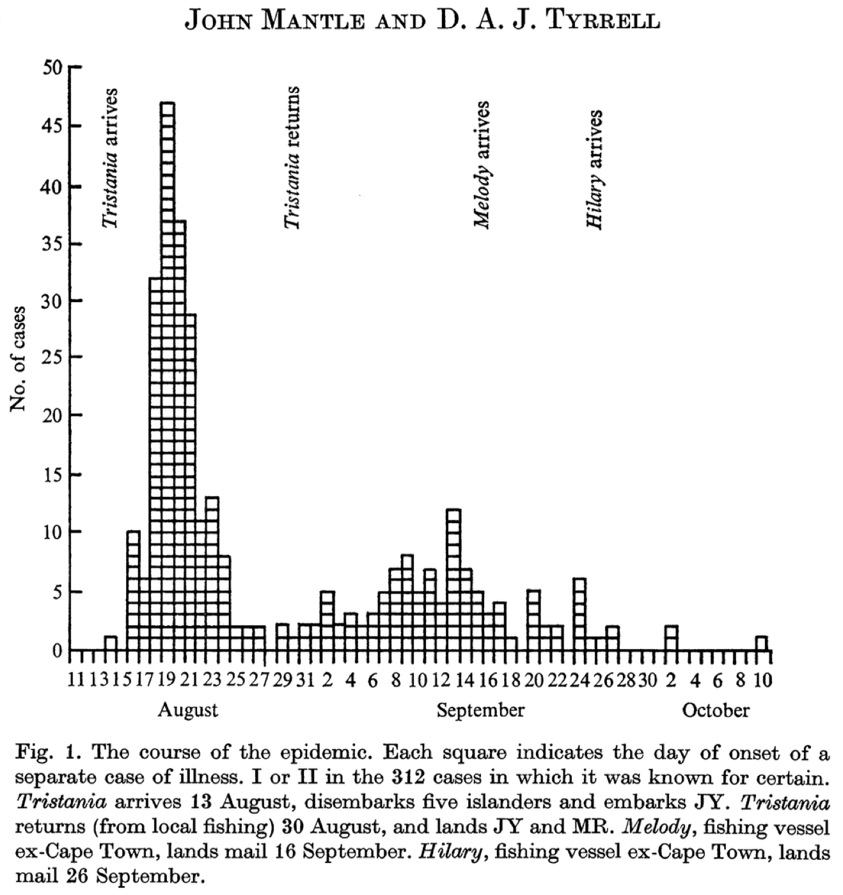

% The SEITL model

```{r setup, echo=FALSE}
knitr::opts_chunk$set(cache=TRUE, fig.path='figure/SEITL_model/', cache.path='cache/SEITL_model/' , fig.cap='', fig.align="center", message=FALSE, tidy=TRUE, warning=FALSE)
```

```{r load, include=FALSE, cache=FALSE}
set.seed(1234)
```

# Background

As you will read below, the SEITL model has been proposed as a mechanistic explanation for a two-wave influenza A/H3N2 epidemic that occurred on the remote island of Tristan da Cunha in 1971. __Given the small population size of this island (284 inhabitants), random effects at the individual level may have had important consequences at the population level.__ For instance, even if the distribution of the infectious period is the same for all islanders, some islanders will stay infectious longer than others just by chance and might therefore produce more secondary cases. This phenomenon is called *demographic stochasticity* and it could have played a significant role in the dynamics of the epidemic on Tristan da Cunha. 

Unsurprisingly, to account for demographic stochasticity we need a stochastic model. However, as you will see in this session and the following, __simulating a stochastic model is computationally more intensive than doing so for a deterministic model__. This is why it is important to understand when and why you need to use stochastic or deterministic models. In fact, we hope that by the end of the day you'll be convinced that both approaches are complementary.


# Tristan da Cunha outbreak


[Tristan da Cunha](http://en.wikipedia.org/wiki/Tristan_da_Cunha) is a volcanic island in the South Atlantic Ocean. It has been inhabited since the $19^{th}$ century and in 1971, the 284 islanders were living in the single village of the island: Edinburgh of the Seven Seas. Whereas the internal contacts were typical of close-knit village communities, contacts with the outside world were infrequent and mostly due to fishing vessels that occasionally took passengers to or from the island. __These ships were often the cause of introduction of new diseases into the population.__ As for influenza, no outbreak had been reported since an epidemic of A/H1N1 in 1954. In this context of a small population with limited immunity against influenza, an unusual epidemic occurred in 1971, 3 years after the global emergence of the new subtype A/H3N2.

On August 13 1971, a ship returning from Cape Town landed five islanders on Tristan da Cunha. __Three of them had developed acute respiratory disease during the 8-day voyage and the other two presented similar symptoms immediately after landing.__ Various family gatherings welcomed their disembarkation and in the ensuing days an epidemic started to spread rapidly throughout the whole island population. __After three weeks of propagation, while the epidemic was declining, some islanders developed second episodes of illness and a second peak of cases was recorded.__ The epidemic faded out after this second wave and lasted a total of 59 days. Despite the lack of virological data, serological evidence indicates that all episodes of illness were due to influenza A/H3N2.

Among the 284 islanders, 273 (96%) experienced at least one episode of illness and 92 (32%) experienced two, which is remarkable for influenza. Unfortunately, __only 312 of the 365 attacks (85%) are known to within a single day of accuracy__ and constitute the dataset reported by [Mantle \& Tyrrell in 1973](http://www.ncbi.nlm.nih.gov/pmc/articles/PMC2130434/). 



# SEITL model

One possible explanation for the rapid influenza reinfections reported during this two-wave outbreak is that following recovery from a first infection, __some islanders did not develop long-term protective immunity and remained fully susceptible to reinfection by the same influenza strain__ that was still circulating. Here is a description of the SEITL model:

_The SEITL model extends the classical SEIR model by splitting the R compartement (recovered) to account for the dynamics and host heterogeneity of the immune response among the islanders. Following recovery, hosts remain temporarily protected against reinfection thanks to the cellular immune response (T-cells). Accordingly, they enter the T stage (temporary protection). Then, following down-regulation of the cellular response, the humoral immune response (antibodies) has a probability $\alpha$ to reach a level sufficient to protect against reinfection. In this case, recovered hosts enter the L stage (long-term protection), but otherwise they remain unprotected and re-enter the susceptible pool (S)._

The SEITL model can be described with five states (S, E, I, T and L) and five parameters:

1. basic reproductive number ($R_0$)
2. latent period ($D_\mathrm{lat}$)
3. infectious period ($D_\mathrm{inf}$)
4. temporary-immune period ($D_\mathrm{imm}$)
5. probability of developing a long-term protection ($\alpha$).

# Parameter values and initial state

Based on the description of the outbreak above and the information below found in the literature, can you think of one or more set(s) of values for the parameters and initial state of the model? 

1. The $R_0$ of influenza is commonly estimated to be around 2. However, it can be significantly larger in close-knit communities with exceptional contact configurations.
2. Both the average latent and infectious periods for influenza have been estimated around 2 days each.
3. The down-regulation of the cellular response is completed on average 15 days after symptom onset.
4. Serological surveys have shown that the seroconversion rate to influenza (probability of developing antibodies) is around 80%. However, it is likely that __not__ all seroconverted individuals acquire a long-term protective against reinfection.
5. Between 20 and 30% of the infections with influenza are asymptomatic.
6. There is very limited cross-immunity between influenza viruses A/H1N1 and A/H3N2.


You can now return to the [practical session](code_sto_model.html) and design the flowchart of the SEITL model. If you need more help, you can have a look at the [deterministic equations](SEITL_deter.html) for the SEITL model.


